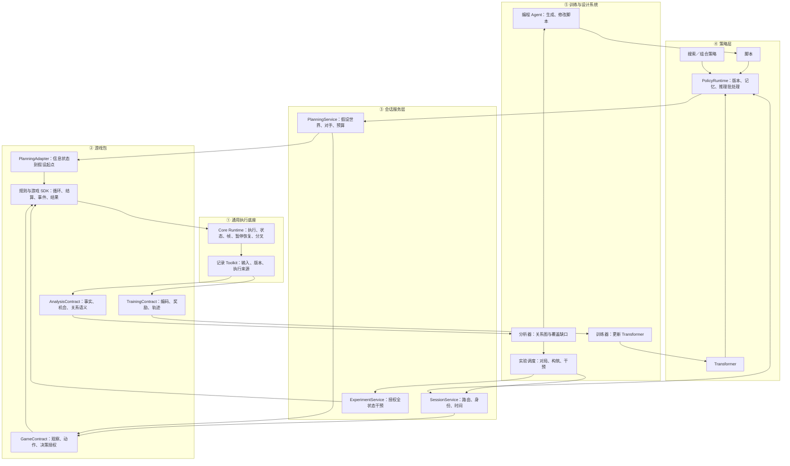
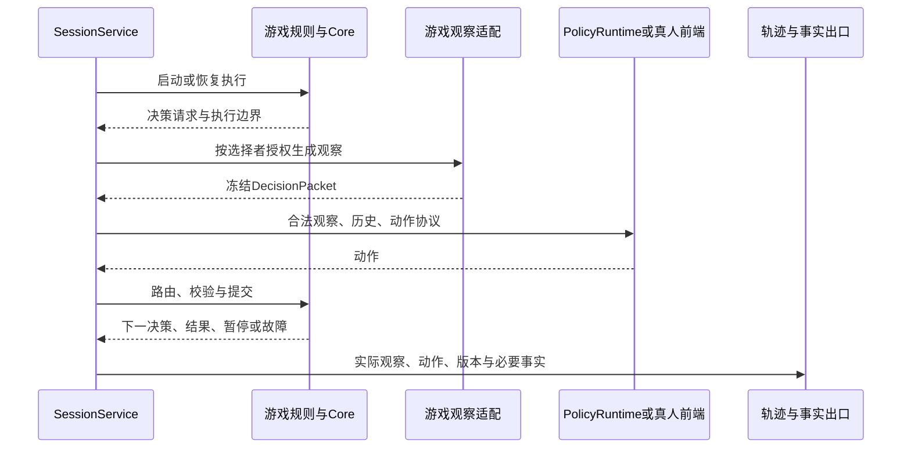
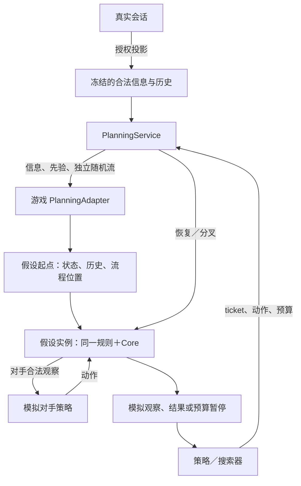
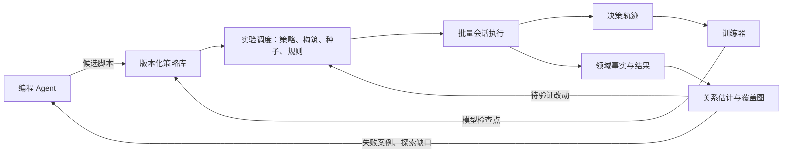

# 分层架构、实现模块与数据流

最新颗粒度以 [当前契约](../spec/runtime-contract.md) 为准：决策点快照；ExperimentInstance 调度多局独立 GameInstance；训练/评测共用策略接口。后端未定，不再默认 JS-Interpreter。下文构建期自研流程和指令级控制仅为历史候选。

状态：设计规格，尚未实现。本文统一截至 2026-10-08 的架构决策。目标是探索游戏策略与构筑，以带条件和证据的关系图评估卡牌机制与数值；规则正确性是前提，不能替代设计评价。

编写目标为受控 TS 与 toolkit；具体语法范围和运行方式随现成后端确定。已有 4070、本地优先、增量计算预算上限 $500；先以 Agent 编写的脚本种群建立设计评估闭环，再接入小 Transformer。训练模型不是关系图的前置条件。[计算预算](cost-estimate.md) 和 [执行预算](runtime-budget.md) 是情景计算，不是性能或学习效果保证。

## 1. 分层与所有权



图表示依赖与数据路径，不表示每步重新编译。规则先构建成冻结程序，真实与假设会话加载同一产物。

| 层 | 负责 | 不负责 |
| --- | --- | --- |
| Core | 执行、完整 context、暂停恢复、分叉、通用记录 | 玩家、生命、回合、胜负、打法 |
| 游戏包 | 全部规则、游戏循环、信息权限、合法动作和结果 | 模型优化、实验调度 |
| 会话服务 | 路由、身份、提交、时间、分支生命周期 | 改变卡牌语义、发明打法 |
| 策略 | 根据合法信息选择动作 | 修改真实状态和规则 |
| 训练与实验 | 策略更新、对手安排、构筑探索、控制变量 | 用胜率证明规则正确 |
| 分析 | 从指定实验与领域事实估计关系 | 从内核写入猜测领域语义与因果 |

共享游戏工具仍属于游戏 SDK，不因多游戏使用就进入 core。规则规定的怪物行为可以属于游戏；可替换的玩家打法属于策略。[分层契约](../spec/layers.md) 定义核心扩展边界。

## 2. 构建与执行（以下为历史候选实现）

```text
游戏 TS 源码＋SDK＋白名单传递依赖
  → 类型、能力、语法校验
  → 受控 CFG／内部流程 IR
  → 显式帧、同步 JS 块、schema、源码映射
  → 版本冻结与产物校验
  → 同一个 Core Runtime 的多个执行实例
```

九种节点是语义依据，不要求作者手写。原生 Promise 不保存游戏续延；批准的同步 TS 计算是原子操作，内部不提供恢复性暂停。循环、替代、触发与延迟任务由游戏程序实现。见 [作者工具](../spec/authoring.md)、[执行规格](../spec/execution.md)。

```typescript
step(program: Program, context: Context): StepResult;
run(program: Program, context: Context, budget: Budget): Boundary;
fork(context: Context): [Context, Context];
resume(context: Context, requestId: RequestId, answer: Value): ResumeResult;
```

这些是职责接口。context 包含程序版本、控制位置、局部环境、显式帧、存储根、授权与请求序号；旧快照保持有效。预算让出不等于游戏终局。随机流与时间输入显式管理，无隐式宿主随机或时钟。Await 类型校验不等于业务动作合法性，后者由游戏校验。

## 3. 真实对局数据流



会话运行器持有执行句柄，策略不得持有 context。策略通道只有合法信息；完整审计记录采用独立权限。训练保存实际交给策略的观察，不能事后从完整世界重新投影代替。

ticket 绑定会话、分支、请求与版本，通过活跃版本校验避免重复和过期提交。游戏验证动作语义；协议拒绝不提交部分业务状态。选择者、行动主体、资源归属和收益归属分别定义。多人同时选择的收集与公开时机属于游戏规则。

真人、脚本、模型与搜索器共用动作协议。真实/虚拟时钟通过显式输入接入；动画在前端消费投影事件，不推进或阻塞规则。见 [会话规格](../spec/session.md)、[公共接口](../spec/ports.md)。

## 4. 受限模拟数据流



没有“真实隐藏 context → 玩家模拟分支”的连接。合法信息相同的真实世界，在相同规划配置下返回相同的模拟响应分布。假设采样随机流不来自真实 seed。

PlanningAdapter 构造 HypotheticalStart，包括必要的控制位置、历史和任务；不能只替换手牌却沿用真实隐藏控制帧。core 不理解信念或牌序概率，只执行构造好的 context。可重建决策范围由游戏声明，不支持则返回 unavailable。

建立假设后，规则、动作验证、观察投影、执行、恢复与分叉完全复用，不维护 simulateDamage 等第二套规则。模拟对手只读取其合法观察。相同信息历史不能按隐藏粒子编号分别选择全知最优动作。

真实与模拟使用独立随机流、日志出口和外部 capability 适配。模拟不能发送真实通知、推进真实时钟或污染实际玩家历史。服务返回不透明句柄，内部管理 owner、假设版本、对手和预算。详见 [受限模拟](../spec/planning.md)。

ExperimentService 在单独授权下可以进行完整真实状态分叉，用于设计反事实分析。这不是合法玩家搜索权限，实验来源必须记录。

## 5. 策略生成、训练和设计数据流



脚本与模型是同等策略候选。Agent 在局外编写代码，不默认参与每步出牌；Transformer 可对抗脚本、历史模型和搜索器。用于训练的对手不再作为独立未知挑战。对抗游戏保留循环克制；单人游戏比较共同场景分布。

三类实验冻结全部策略、只开放战术适应、或开放构筑与打法适应。脚本改写和权重更新都是适应，范围与成本必须记录；一次脚本改写不等于一个梯度步。规则正确性验证与设计评价分别报告。

关系证据绑定：规则/内容、编译器/原子、观察/动作/收益契约、策略与记忆配置、构筑、对手分布、种子、预算、分叉来源、机会分母、分析版本和不确定性。相关与因果分开；未找到用法不等于废卡。

产品游戏 AI 复用策略库，但另按延迟、难度、风格和体验验收，不把最高研究胜率等同最佳产品 AI。见 [策略层](../spec/policies.md)、[训练与实验](training.md)。

## 6. 包布局与部署

统一沿用作者工具文档的 core-ir/runtime 命名，两者合称 core 层。下面是未来布局，尚未创建实现。

```text
packages/
  core-ir/             值、节点、schema、程序与校验协议
  runtime/             执行、context、快照、分叉、记录
  sdk/                 通用规则编写接口
  compiler/            TS 到显式帧与同步 JS 块
  checks/              编译与 lint 共用强制检查
  eslint-plugin/       编辑器诊断
  session/             路由、生命周期、时间
  planning/            假设世界、模拟调度、权限与预算
  policy-protocol/     观察、动作、记忆、策略版本协议
  policy-runtime/      脚本执行隔离与路由
  experiments/         对局、构筑与设计干预
  analysis/            关系估计、覆盖与证据查询

games/<game>/
  rules/               规则与专属组合 SDK
  contracts/           游戏、训练与分析契约
  planning/            信息约束、假设构造与恢复入口

policies/
  scripts/             版本化脚本候选
  search/              搜索与组合策略

training/
  model/               Transformer
  learner/             优化、采样与检查点管理
  inference/           GPU 批量推理
```

CPU 上运行游戏与脚本，GPU 执行模型。多个 worker 各可维护多个等待 context，跨会话合批、同一会话有序。Python 训练与 TS 执行共享协议而非运行时；初版批量二进制通信，不传完整世界，不默认逐 token 往返。共享内存及原生热点优化由测量决定。

## 7. 未完成项

本文记录完整的分层决定，不代表所有语义契约已闭合。TS profile、提交/取消、复杂游戏流程组合、规划起点构造、策略隔离和预算计量仍需落实。人工表达能力证明不能证明实际编译器或商业游戏复刻正确。按 [实施计划](plan.md) 推进，未实现项不标完成。
