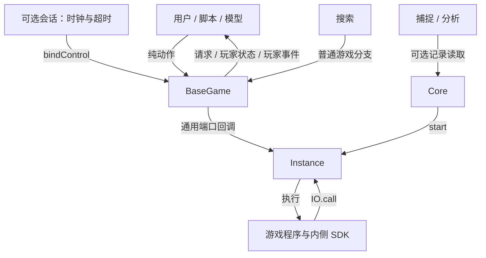

# 三层与横向能力

| 功能 | Core | Instance | BaseGame |
| --- | --- | --- | --- |
| 创建与执行 | 装载程序、创建实例 | 推进、读取停止状态、关闭 | 持有实例，解释游戏状态 |
| 输入输出 | 程序与端口声明 | 发出调用、接受一次返回 | 游戏请求、动作、事件 |
| 玩家交互 | — | — | 请求直接指定 player，状态和事件投影 |
| 合法动作 | — | 校验端口结构 | 游戏描述并校验动作 |
| 会话控制，可选 | — | 普通端口返回 | 独立 bindControl，游戏解释时间/超时 |
| 保存恢复，可选 | 提供恢复能力 | 完整现场保存 | 复用实例保存 |
| 分支，可选 | — | 同类型独立实例 | 同类型独立游戏 |
| 捕捉，可选 | 提供记录访问 | 记录调用与返回 | 上层解释训练和分析数据 |

Core 提供执行机制。Instance 持有受控程序的栈、局部变量、闭包、对象图、SDK 状态及待决调用。BaseGame 持有 Instance 的外部控制权。配套 lib `@bear-forge/game-sdk` 和游戏领域 SDK 属于被执行内容；玩家回调和外侧 GameContract 处理器在宿主侧。



## 数据流

1. 装载程序，Core.start 运行至首次端口等待或结束。
2. binder 接管 Instance，调用方提供与程序匹配的 GameContract。
3. 输入端口经 receive 产生 view 和请求列表；每个请求直接含 key/player/type/data。
4. BaseGame 为请求附加实例/调用身份、该玩家观察与合法动作描述，交给对应 onRequest。
5. 回调只返回动作。纯 respond 校验并编码为端口返回；原程序验证后结算。
6. 会话控制使用独立回调和游戏定义的数据，经独立 respond 编码到同一个端口；游戏决定时钟、超时和默认行为。
7. 游戏发布事件；projectEvent 按玩家生成可见事件，onEvent 接收入队。
8. 一次游戏 run 最多接受一个动作或会话控制，再交付后续事件，到下一请求、结束或暂停时返回具体接受结果。

同时选择由游戏保存部分输入、封存结果和发布剩余请求。外侧一次交付一个返回；结算顺序和共同决策结束条件在程序里。

## 源码目录

```text
packages/
  contracts/
    src/
      core/          program、core、loading 的类型及 schema
      instance/      instance、persistence、capture、branching
      game/          game、authoring、binding、session
      internal/      包内类型辅助
      index.ts       日常入口
      loading.ts     保持既有 /loading 公共入口的 re-export
    tests/
      core/          Core 层测试
      instance/      Instance 层测试
      game/          Game 层测试
      support/       共用协议测试夹具
      *.test.ts      跨层协议、schema 和依赖边界测试
  game-sdk/
    src/
    tests/
examples/
  doudizhu/
    src/
    tests/
```

协议文件按职责命名为 `*.types.ts` 和 `*.schemas.ts`。各层的公共导出和保存/捕捉兼容入口仅做 re-export。源码归属与包的公共导入路径分别管理；目录迁移保持下列导入路径不变。

## 包路径

```text
@bear-forge/contracts              十个日常入口类型
  /core                           程序、端口、创建
  /instance                       通用回调、单步运行、状态、关闭
  /game                           请求、纯动作、玩家交互
  /authoring                      游戏程序、SDK、共享端口、纯适配声明
  /session                        可选会话控制
  /persistence                    可选保存恢复
  /branching                      可选同类型分支
  /capture                        可选执行记录
  /loading                        装载、接管和可选能力组合
src/internal                      类型检查辅助工具
@bear-forge/game-sdk               可执行内侧 lib：createGameSDK
```

基础入口不导出保存、记录、训练或搜索辅助类型。基本 Core/Instance/Game 声明不依赖可选功能声明；loading 在接线时组合实际提供的能力。各模块 tests/architecture.test.ts 检查自身源码的依赖边界，包含在该模块的 npm test 中；根目录通过 workspaces 汇总。

游戏目录：schemas.ts 定义领域数据；types.ts 特化公开契约；program.ts 是主循环；sdk.ts 组合公共 game-sdk lib 与实例内随机流；rules.ts/patterns.ts 实现规则；module.ts 声明 GameModule 与纯处理器。

C01 交付公共声明、完整斗地主及原生协议消费者。生产执行、保存续延及正式绑定器在 C02/C03 验收。

内侧 lib 与外侧功能的逐项对应、类型关联和语义法则见 protocol.md 的“内侧 lib 与外侧功能配套”。GamePortDeclarations 同时用于 Program 的端口 schema 与内侧函数生成；GameContract 受同一端口类别/输入/返回类型约束。Core/Instance 不依赖该游戏声明或 lib。lib 不持有 BaseGame、Instance 控制句柄或宿主回调。

测试归属对应模块：contracts/tests 验证公共契约；game-sdk/tests 验证内侧库及游戏接口接线；doudizhu/tests 验证具体游戏。contracts/tests/support 的协议夹具由依赖模块的测试复用，不作为生产包导出。
