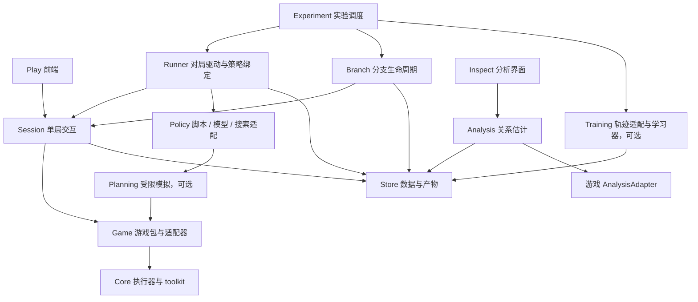
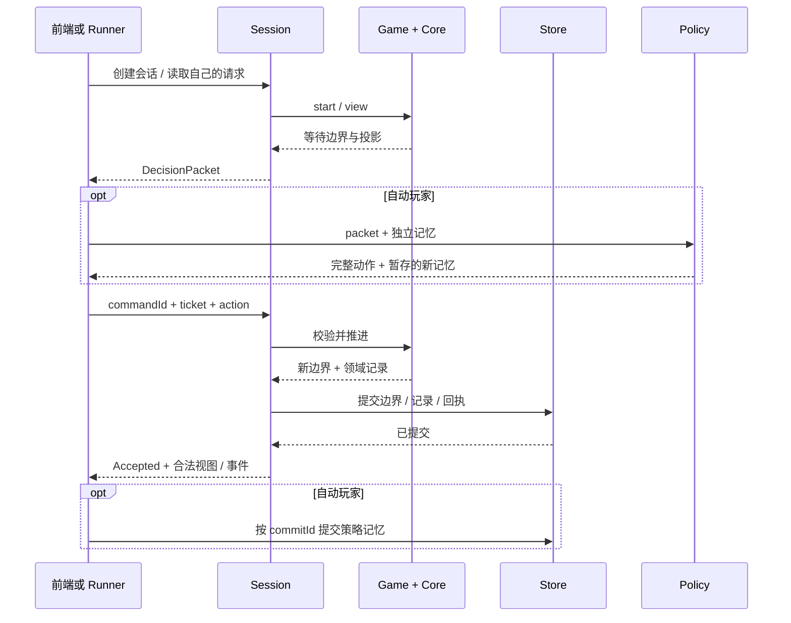

# 模块架构与固定协议 v0.1

本文是模块边界和公共协议的唯一基线。依据[需求](requirements.md)，用[业务场景](scenario-resolution-requirements.md)检查接口是否足以表达。文件树是拟建目录，协议是待实现契约；当前没有对应运行代码。

本次固定：模块归属、依赖方向、输入输出、提交语义、权限、版本与错误分类。内部使用何种编译器、执行库、保存格式、数据库、模型及通信方式，留在模块内部另行确定。后续实现不能靠偷偷增加跨模块访问来补协议缺口；变更须同步本文、契约版本与验收。

## 1. 模块图：谁依赖谁

下图箭头表示“调用或依赖”，不是数据传播方向。所有模块均可依赖 Contracts；Contracts 不依赖其他模块。图中模块可以运行在同一进程，并不要求微服务。



| 模块 | 拥有的内容 | 向外提供 |
| --- | --- | --- |
| Core | 执行现场、通用请求/回复、记录、受控输入；可选保存恢复扩展 | 执行端口、保存恢复端口、作者 toolkit |
| Game | 卡牌与所有规则、游戏循环、领域随机过程、观察投影、合法动作、胜负 | GameDriver；游戏自己的 SDK；训练与分析适配器 |
| Session | 单局身份、请求票据、权限、时间输入、提交顺序、幂等、可见事件流 | 真人和策略共用的单局协议 |
| Runner | 席位与策略绑定、策略调用、记忆提交、对局推进 | 跑一局、导出执行检查点 |
| Policy | 根据合法输入生成完整动作、策略私有记忆 | 同一 decide 协议；脚本和模型都接此口 |
| Branch | 保存点引用、新会话身份、分支血缘、资源释放 | 保存/恢复/分支服务；不决定实验目的 |
| Experiment | 任务组合、干预、采样计划、预算、重试、冻结版本 | 实验任务与结果目录 |
| Training | 游戏编码、按 actor 整理轨迹、学习、新策略产物 | 数据集契约、训练作业、PolicyArtifact |
| Planning | 合法信息到假设世界、受限模拟、搜索预算 | 玩家可用的模拟服务 |
| Analysis | 机会分母、条件关系、覆盖、不确定性、证据索引 | RelationGraph |
| Store | 不可变产物、提交记录、查询、去重 | 统一存取端口 |
| Play / Inspect | 对局表现与动画 / 关系图和证据展示 | UI；不参与权威规则计算 |

**依赖约束：Core 不导入 Game、Session、Policy、Experiment 或 Training；Session 不导入 Policy 或 Training。** Game 的训练/分析适配器是独立入口，运行游戏无需加载它们。规划使用 GameDriver 运行假设世界，无权调用 Branch 获取真实隐藏世界。

## 2. 拟建代码文件树

以下目录在实现阶段按需创建，不创建空壳冒充完成。`contracts` 只放边界类型/schema，具体游戏数据在游戏包中定义。

```text
bear-forge/
├── README.md / AGENTS.md / checkpoints.json
├── docs/                         # 当前有效规格与唯一计划
├── packages/
│   ├── contracts/src/
│   │   ├── common.ts             # ID、版本、数据值、错误、产物引用
│   │   ├── execution.ts          # Core 运行与保存恢复端口
│   │   ├── game.ts               # GameDriver、Decision、动作空间
│   │   ├── session.ts            # 单局命令、票据、提交回执
│   │   ├── policy.ts             # PolicyArtifact、输入输出、记忆
│   │   ├── experiment.ts         # 任务、分支、运行检查点、结果
│   │   ├── records.ts            # 提交、合法轨迹、审计、数据集
│   │   ├── training.ts           # 编码适配、训练作业、产物
│   │   ├── planning.ts           # 合法信息与假设模拟
│   │   └── analysis.ts           # 关系、机会、证据
│   ├── core/src/
│   │   ├── index.ts              # 唯一运行端口出口
│   │   ├── toolkit.ts            # 游戏作者可用的通用能力
│   │   ├── build.ts              # 受控源码到程序产物的构建入口
│   │   └── internal/             # 执行/转换/保存内部实现，暂不规定
│   ├── session/src/{index,clock,projection,commit}.ts
│   ├── runner/src/{index,bindings,memory}.ts
│   ├── branch/src/{index,lineage}.ts
│   ├── policies/src/{random,first,last,script,model}.ts
│   ├── experiment/src/{index,schedule,budget,intervention}.ts
│   ├── store/src/{index,artifacts,records}.ts
│   ├── training/src/{index,trajectory,dataset}.ts
│   ├── planning/src/{index,limits}.ts
│   └── analysis/src/{index,estimate,coverage,evidence}.ts
├── games/<game-id>/src/
│   ├── manifest.ts              # 版本、schema、支持能力
│   ├── program.ts               # 游戏循环及结算入口
│   ├── sdk/                     # choose、伤害、触发等游戏抽象
│   ├── rules/                   # 卡牌、时序、领域状态
│   ├── driver.ts                # 规则程序到 GameDriver 的适配
│   ├── observation.ts           # 各身份可见状态及事件
│   ├── actions.ts               # 结构化动作空间与最终校验
│   ├── training.ts              # 游戏编码与奖励口径，后置
│   ├── analysis.ts              # 卡牌/体系/机会/干预的语义
│   └── hypotheses.ts            # 合法信息构造假设世界，后置
├── apps/{play,inspect}/         # 两种前端，不各写一套规则
├── tests/contracts/            # 黑盒协议一致性测试
├── tests/scenarios/            # 场景与期望结果
├── evidence/                   # 各 checkpoint 的实际验收证据
└── tools/                      # 文档/计划审计等工具
```

目录不规定语言间桥接方式。学习器可以是独立进程，通过相同版本的数据集和产物协议接入。首版不创建模型、训练或规划的空实现。

## 3. 共同约定

1. **版本**：每次运行固定 `protocolVersion`、游戏规则/内容/配置摘要、程序产物、数据 schema；涉及策略再固定策略/编码版本。旧快照仅由声明兼容的程序与 codec 恢复，默认不兼容即拒绝，不猜测迁移。
2. **边界数据**：公开 payload 为可序列化 `Value`（null、布尔、有限数、字符串、数组、字符串键对象）；大张量/权重/快照用 `ArtifactRef {id, digest, mediaType, schemaVersion}`。闭包、句柄、指针不跨模块边界。进程内私有 handle 只供持有它的模块调用。
3. **身份分开**：`matchId` 是逻辑对局，`sessionId` 是一次会话实例，`branchId` 是演进分支，`requestId` 是该实例当前请求，`commandId` 是一次提交，`commitId` 是一次成功状态转换。恢复产生新 session/request 身份；血缘保留旧分支与保存位置。
4. **错误分开**：`rejected` 表示输入不被接受，状态不变；`fault` 表示执行/存储/服务失败；`truncated` 表示外部预算/停止导致采样结束；`terminal` 是游戏规则产生的结果。计算超时不能自动转成游戏输局。
5. **运行能力**：`capabilities` 明确 `run`、`checkpoint`、`durableRecovery`、`hypothesisSimulation`。直接运行只要求 `run`；不支持保存的实现返回 `unsupported`，调度器在开始任务前检查所需能力。
6. **一个推进单位**：提交一份完整游戏输入，执行自动逻辑，停在下一真实外部输入边界或结束。动作参数生成不推进游戏。公开协议不出现 pc、调用栈或编译器节点。

## 4. P1：Core ↔ Game，执行协议

以下签名固定操作和语义。带名 payload 的字段在各表定义；不是声称已经存在可编译的源码。

```ts
interface ExecutionPort {
  start(program: ProgramRef, input: Value, controls: RunControls, budget: WorkBudget): Execution;
  advance(handle: ExecutionHandle, reply: RequestReply, budget: WorkBudget): Execution | RequestRejected;
  close(handle: ExecutionHandle): void;
}
interface CheckpointPort {          // 可选扩展
  save(handle: ExecutionHandle): RuntimeSnapshotRef;
  restore(snapshot: RuntimeSnapshotRef, bindings: BindingManifest): Execution;
}
// Execution = { handle, boundary, records }
// boundary = Waiting { request: { id, channel, payload } }
//          | Done { value } | Fault { code, diagnosticRef }
// RequestReply = { requestId, payload }
// RequestRejected = { code }; handle remains at the original waiting boundary.
```

- `ProgramRef` 定位不可变程序、输入/输出 schema 与构建摘要；`RunControls` 指定受控随机/时间/外部能力绑定，状态必须纳入恢复契约。`BindingManifest` 声明恢复时允许重绑定的无隐状态能力及版本。
- `WorkBudget` 是执行资源上限。预算失败归 fault，上层可以据此截断任务。`records` 是从上个边界到本边界产生的通用数据记录，Core 不解释记录中的“伤害”。
- `start` 推进至首个边界；`advance` 只能回复当前请求。相同 handle 的推进必须串行。`Done` 只是程序返回，由 Game 解释成游戏结果。
- `save` 在完整等待边界或 Done 生效，包含后续执行需要的全部运行状态、待决请求、受控状态和记录游标。`restore` 返回保存时的边界，不重新执行此前结算；新执行实例与旧实例隔离。
- 成功推进产生一个完整新边界和对应记录；失败不发布部分记录。失败实例只允许关闭或从最近保存点恢复，不能假设它可继续。
- 规则包的 `game.choose`、循环、递归、触发与结算由游戏代码构造。Core 只看到通用 request/reply。toolkit 的作者语法和控制状态表示属于内部设计，不在此处冻结。

已有游戏引擎可直接实现下一节 GameDriver；它不因此成为 Core 的一种游戏特例。直接运行后端与可恢复后端均遵循同一外部边界语义。

## 5. P2：Game ↔ Session，游戏协议

```ts
interface GameDriver {
  manifest(): GameManifest;
  start(setup: Value, controls: GameControls): GameBoundary;
  apply(input: GameInput): GameBoundary | GameRejection | GameFault;
  view(principal: Principal): GameView;
  actionSpace(principal: Principal, query: ActionQuery): ActionSpaceReply;
  save?(): GameSnapshotRef;
  restore?(snapshot: GameSnapshotRef): GameBoundary;
  close(): void;
}
```

一个 Driver 只承载一个世界，由 Session 独占推进。Core handle 在 Driver 内部。`GameSnapshotRef` 包含规则世界及其所需执行/随机状态，不能只复制可见棋盘。

| 类型 | 固定内容与语义 |
| --- | --- |
| GameManifest | 游戏/规则/配置版本；setup、action、observation、event、result schema；能力清单；角色/席位定义 |
| GameControls | 显式随机配置、初始游戏时间、允许的外部输入类型；由可信宿主提供 |
| GameBoundary | `waiting`：boundaryKey、输入描述；或 `terminal`：result；两者都含本次领域记录。boundaryKey 是当前世界内的边界标识，不是公开提交票据 |
| 输入描述 | 输入 kind、允许的主体集合、各主体的请求投影、可选 deadlineSpec。等待多个主体时由游戏规定接收顺序、封存回复和揭示条件 |
| GameInput | 当前 boundaryKey、主体、kind（action/time/external）、payload。身份与真实接收时间由 Session 提供，不信任客户端自报 |
| GameView | 当前主体可见的 observation、状态/待决请求投影、游戏定义的可见事件；隐藏字段及隐藏事件数量不得通过空占位泄露 |
| GameRejection | 游戏定义的非法原因；原因对提交人也必须经过可见性过滤；不推进、不改变随机流、不产生领域记录 |
| ActionQuery | 当前边界与主体、动作参数 prefix、查询模式和 cursor。查询无游戏副作用 |
| ActionSpaceReply | 当前前缀是否有效/可完成、下一参数约束、可完成动作；可选稳定有序分页、精确首尾、合法采样能力声明 |

最终完整动作仍由 `apply` 权威校验，类型正确不等于动作合法。动作空间不要求穷举；参数前缀只在真正完整时才能提交。RandomLegal 声明采样分布，First/LastLegal 要求游戏提供确定全序及首尾查询；缺能力时拒绝该策略绑定，不能用“本页最后一个”冒充全空间最后一个。

游戏自有循环决定何时返回等待。同一张牌里两次选择就是两次边界；无人选择时可以直接自动结算到下一边界。同时行动可逐份接收封存输入，但其他主体的 view 不能透露已提交内容。主体资格、游戏计时、超时默认动作与游戏结束均由游戏规定。

## 6. P3：Session ↔ 客户端/Runner，单局协议

```ts
interface SessionPort {
  create(spec: SessionSpec): SessionRef;
  read(session: SessionRef, auth: AuthContext): SessionView;
  actions(session: SessionRef, auth: AuthContext, query: ActionQuery): ActionSpaceReply;
  submit(session: SessionRef, auth: AuthContext, cmd: Submit): SubmitResult;
  events(session: SessionRef, auth: AuthContext, cursor?: string): VisibleBatch;
  receipt(session: SessionRef, auth: AuthContext, commandId: string): ReceiptStatus;
  close(session: SessionRef): void;
}
interface SessionAdminPort {       // Branch and the trusted clock only
  checkpoint(session: SessionRef): SessionCheckpointRef;
  restore(checkpoint: SessionCheckpointRef, lineage: BranchLineage): SessionRef;
  deliver(session: SessionRef, input: HostInput): SubmitResult;
}
// Submit = { commandId, ticket, action }
// SubmitResult = Accepted { receipt, view }
//              | Rejected { code, currentView }
//              | Failed { code, diagnosticRef }
```

| 对象 | 固定内容 |
| --- | --- |
| SessionSpec | 固定游戏版本/setup、主体权限、随机配置、clockMode（real/virtual）、所需能力、持久化模式 |
| DecisionPacket | 协议/schema 版本；session/branch/request 身份；actor；不可伪造或可核验 ticket；实际 observation 与可见 history/event cursor；actionSpec；游戏 deadline 信息 |
| Receipt | commandId、commitId、原请求身份、acceptedAction 摘要、新边界标识或终局、记录区间。字段按主体权限投影 |
| ReceiptStatus | committed（原回执）、pending、rejected、unknown；崩溃恢复不能将“可能已提交”误报为“未提交” |
| VisibleBatch | 当前主体的可见事件序列、新游标与可见状态；游标是主体范围的不透明值 |

**提交规则固定如下：**

1. Session 验证身份、票据、当前请求、分支与提交内容，然后调用 Game；调用方不能通过 action 指定自己的权限。
2. 同一 `commandId` 和相同内容重试，返回原回执，不再次执行；同 ID 不同内容拒绝。不同 commandId 回复已消费票据，按过期拒绝。两次并发提交由 Session 排序，至多一次消费同一票据。
3. 新状态、记录、回执作为一个提交发布。推进或持久化失败时不向订阅者暴露部分结果；持久化模式须能恢复最后已提交边界与回执。失败 handle 不能继续服务。
4. 仅 `Accepted` 消费票据。非法/越权动作不会移动等待点；自动逻辑执行故障返回 `Failed`，由宿主恢复或停止，不能继续拿故障现场当原等待点。
5. 恢复/分支后发新票据。原问题内容与可见状态保持一致，旧会话的票据不能用于新会话。
6. 超时由可信时钟适配器提交记录化的 time 输入；真实/虚拟时钟使用同一游戏处理路径。动作与超时的先后由 Session 排序，并按游戏声明的期限边界规则裁决。虚拟时钟由调度器推进，不能因模型计算慢而自动消耗游戏时间。
7. 动画只消费已提交的可见事件；不发“动画结束才能继续规则”的确认。重连按 cursor 读取，游标失效返回重置视图及新游标。

`auth` 是宿主鉴权结果，不是策略自填的数据。策略一般只收到属于自己的 DecisionPacket；无待决权时不能要求读取别人的 packet。

SessionAdminPort 是单独注入的管理能力，不能由客户端通过自填角色获得。`HostInput` 包含 commandId、当前边界、受允许的 time/external 类型、payload 与可信来源。虚拟时钟推进也走 deliver。Branch 通过此管理口保存/恢复；checkpoint 能力缺失时明确拒绝。持久化恢复由 Session 负责重新建立最新提交头，再对外发放可用会话。

## 7. P4：Runner ↔ Policy，策略协议

```ts
interface PolicyPort {
  describe(): PolicyArtifact;
  decide(input: PolicyInput): Promise<PolicyProposal>;
}
// PolicyInput = { packet, visibleHistory, memory, policyRandom, budget, services }
// PolicyProposal = { action, nextMemory, nextPolicyRandom, behavior? }
```

- `PolicyArtifact`：不可变 id/digest、策略 kind、输入/action/编码 schema、模型或脚本引用、记忆 codec、所需服务。内存可为 null；GPU cache 是可重建缓存。
- `behavior`：实际策略版本、可选完整动作 logProbability、分布/采样版本。自回归概率覆盖整份动作；脚本未提供的概率记 missing，不捏造 1。
- `services`：合法动作查询和经授权的 PlanningPort；没有真实快照、审计库或游戏 seed。
- `PolicyBinding`：seat、固定 artifact、独立 memory 与随机状态。共享权重不共享可变记忆。
- Runner 先暂存 proposal 与下一份记忆，再以 commandId 提交动作；确认 committed 后按 commitId **恰好一次**提交记忆。响应丢失查 receipt，不盲目重新推理/重新提交。拒绝或 fault 不提交 nextMemory。
- durableRecovery 下 proposal 暂存也要持久化；恢复先对齐 Session 回执与策略记忆。`RunCheckpoint` 必须在无未决提交或已完成对齐时生成。

真人直接调用 Session，无需伪装 Policy。神经推理合批可以在 Policy 实现内完成，不改变每局票据和记忆提交规则。

## 8. P5：分支、对局与实验协议

```ts
interface BranchPort {             // 可信管理端，策略不可直连
  save(session: SessionRef): SessionCheckpointRef;
  restore(checkpoint: SessionCheckpointRef): SessionRef;
  fork(checkpoint: SessionCheckpointRef, count: number): SessionRef[];
}
interface RunnerPort {
  run(spec: MatchSpec): Promise<RunResult>;
  checkpoint(runId: string): RunCheckpointRef;
  resume(checkpoint: RunCheckpointRef): Promise<RunResult>;
}
interface ExperimentPort {
  run(spec: ExperimentSpec): Promise<ExperimentResultRef>;
  stop(experimentId: string): void;
}
```

| 对象 | 固定内容 |
| --- | --- |
| SessionCheckpoint | 游戏保存引用、版本、待决语义内容、时钟状态、已提交游标与回执索引、血缘；管理权限数据 |
| RunCheckpoint | SessionCheckpoint + 每席位策略版本/记忆/随机状态 + 调度游标。保存前完成提交对齐 |
| MatchSpec | taskId、attemptId、固定游戏/setup、seat→PolicyBinding、随机配置、预算、输出权限、可选起点/血缘 |
| RunResult | terminal/truncated/fault 三选一；游戏结果仅 terminal 有；记录与产物引用、实际版本、耗费、起点/结束点 |
| ExperimentSpec | 不可变任务清单生成规则、游戏/构筑/策略候选、座次与随机设计、干预模式、预算/停止规则、指标口径、探索/确认集划分 |
| BranchLineage | rootSampleId、parentBranchId、保存点 commitId、分支干预。共同前缀不当新独立样本 |

**调度器决定“为什么分支、分多少个、给哪个策略”；Branch 实施恢复与分配身份；Core 仅恢复运行现场。** Branch 无需依赖训练库，调试、真人存档、分析实验也可以使用。

恢复已有分支用于重试；创建新分支用于不同后续输入，两者有不同 attempt/branch 语义。每个逻辑 task 最多选定一个有效 attempt 进入主统计，其他 attempt 保留审计。完整对局实验不要求保存能力；分支实验须先检查 checkpoint 能力。

首版干预 `frozen` 固定构筑/策略，只改变声明规则/卡牌配置；协议保留 `tactical` 和 `ecological`，未实现就拒绝，不降级。规则改变默认从 setup 启动新对局，不把旧版本快照硬加载到新规则；跨版本中途干预须另行定义迁移协议。

训练作业若自行调度采样，则该批 MatchSpec 只有训练作业一个调度所有者；Experiment 只提交作业与总预算，避免两套调度器重复派发。

## 9. P6：记录、Store 与训练协议

记录按用途分三类，不从同一未经投影的全量日志直接喂模型：

| 记录 | 内容与消费者 |
| --- | --- |
| CommitRecord | session/branch/commit/command、父提交、输入和边界摘要、版本、记录范围；供恢复、去重、审计 |
| ActorRecord | 实际下发 packet、可见事件、实际动作、实际行为版本/概率、actor、策略记忆版本、对应 commit；供训练与策略复盘 |
| AuditRecord | 授权完整领域事实、机会、随机/隐藏状态证据、终局、血缘；供规则诊断与分析 |

```ts
interface StorePort {
  put(artifact: ArtifactInput): ArtifactRef;
  get(ref: ArtifactRef, auth: AuthContext): ArtifactData;
  append(batch: CommitBatch, expectedHead: string | null): AppendReceipt;
  query(query: RecordQuery, auth: AuthContext): RecordPage;
}
interface TrainingAdapter {
  encode(packet: DecisionPacket, history: Value): EncodedInput;
  assemble(records: ActorRecord[], spec: TrajectorySpec): Trajectory[];
}
interface LearnerPort {
  train(job: TrainingJob): Promise<PolicyArtifact>;
}
```

`CommitBatch` 含 commit 元数据、权限分区的记录、持久化模式所需边界引用和回执；`append` 按 commitId 幂等，按 expectedHead 检查同一分支前驱，批次全有或全无。同键不同内容拒绝。Store 的物理实现不在协议中规定。Session 管游戏提交；Runner 的 proposal/记忆日志通过第 7 节的回执对齐连接，不能假装两个独立写入天然原子。

`TrajectorySpec` 固定 encoder/reward 版本、actor 映射、奖励归属与时间跨度、terminal/truncation/bootstrap 规则。Trajectory 每段包括原观察、完整动作、行为信息、下一合法观察、rewardSpan 和结束原因；一个 actor 两次决策之间的可见事件与奖励不漏不重。critic 若需要特权数据必须建立显式独立的数据集权限，默认训练数据只有 ActorRecord。

`TrainingJob` 固定数据集/采样任务引用、初始策略、算法配置摘要、预算、评测集与产物兼容要求。学习器输出新 PolicyArtifact，由下一次绑定显式采用；不原地覆盖评测中的策略。缺行为概率的数据可用于适用的离线/模仿算法，不能被当作满足 PPO 原策略条件。

构筑也可以是游戏声明的一类 decision，或 Experiment 预先选择的 setup。协议支持两者；训练什么由任务清单与 TrajectorySpec 明示，不由模型结构暗中决定。

## 10. P7：受限规划与分析协议

```ts
interface PlanningPort {
  open(info: LegalInfoRef, budget: PlanningBudget): PlanningSession;
  step(simulationId: string, hypotheticalAction: Value): SimulatedView;
  close(simulationId: string): void;
}
interface AnalysisPort {
  estimate(request: AnalysisRequest): RelationGraph;
  evidence(query: EvidenceQuery, auth: AuthContext): EvidencePage;
}
```

Planning 的 LegalInfoRef 绑定请求主体、实际可见历史和信息集；服务从它调用游戏 `HypothesisAdapter` 构造假设世界。假设采样来源/版本固定，结果只能通过同一主体的 view 返回，且标明是假设。无法构造时返回 unsupported。节点/步数/时间预算由服务执行；模型不能拿真实 SessionCheckpoint 替代假设输入。

AnalysisRequest 固定数据集、实体/关系种类、条件切片、机会定义、估计器版本与探索/确认角色。游戏 AnalysisAdapter 把领域记录转为实体、机会和结局；统计模块不硬编码生命/离场。

RelationGraph 的节点可为卡牌、构筑、策略或体系；每条关系包括：端点（允许多实体关系）、方向/关系类型、条件、观察或干预标记、适应范围、估计与不确定性、机会分母、独立样本单位/数量、coverage、status（supported/unknown/notApplicable）、证据引用。协同可用超边或关系节点表达，不硬压成两两胜率。循环克制保留方向，不强制总排名。

## 11. 数据流：一套游戏的三种用法



上图展示持久化会话的成功路径；内存会话仍保持相同提交可见性。拒绝不产生游戏提交，故障走恢复/停止协议。

- **直接运行**：GameDriver → Core；不加载 Session、策略或训练。调用者自己处理输入和结果。
- **真人游玩**：Play → Session → Game；动画读取已提交事件，输入仍走相同票据与校验。
- **训练/分析**：Experiment → Runner → Session；Runner 调用脚本/模型；ActorRecord → Training，AuditRecord → Analysis → Inspect。训练更新的是下一份策略产物，不是游戏规则。

## 12. 对协议的完善性检查

### 12.1 用既有 15 个 case 检查

表中“覆盖”表示已有明确责任方和可检验行为；运行实现的验收在 C02/C03 执行。

| case | 压力内容 | 承担协议 | 必须观测的判据 |
| --- | --- | --- | --- |
| 1 | K4 两种选择 | P1/P2/P5 | 同保存点分支后手牌、伤害总量各自正确且互不污染 |
| 2 | 来源离场但触发保留 | P2 | 游戏记录的触发来源/控制者保留，Core 不重新解释来源 |
| 3 | K2–K6 跨进程恢复 | P1/P5 | 原等待内容恢复；费用、伤害、记录不重复 |
| 4 | K3 多分支 | P5 | 独立会话与票据、共有前缀血缘可追踪 |
| 5 | 私有选牌与不同后续牌序 | P2/P3/P6 | A 的观察和各分支牌序正确，B 无隐藏泄露 |
| 6 | 选择已死亡目标 | P2/P3 | 拒绝且仍是原边界，随机/记录/记忆不前进 |
| 7 | 越权、错类型、非法弃牌 | P2/P3/P4 | 游戏与会话分层拒绝；反馈不泄露私有数据 |
| 8 | 重复/过期决策 | P3/P4 | 重试原回执、不同内容拒绝、新请求不被旧提交消费 |
| 9 | 跨分支票据 | P3/P5 | 内容相同的选择也不能复用其他会话票据 |
| 10 | 离场返回成为新对象 | P2 | 游戏以实例身份验证目标，不由 Core 猜对象等价 |
| 11 | 可见世界相同但执行位置不同 | P1/P5 | 保存包含继续语义；两种恢复各到正确后续 |
| 12 | 推进中途故障 | P1/P3/P6 | 无部分公开提交；可恢复最近边界或明确 fault |
| 13 | K6 改选治疗对象 | P2/P5 | 仅后续治疗不同，前缀费用/抽牌/伤害不重做 |
| 14 | 提前反击终止结算 | P2 | 游戏返回正确后续边界，不强行要求出现 Q1–Q6 |
| 15 | 自动跳过无须选择的步骤 | P2/P3 | 没有伪造决策；结束结果及记录正确 |

### 12.2 超出这 15 个 case 的模块接缝

| 接缝 | 协议已固定的处理 | 实施验收 |
| --- | --- | --- |
| 动作接受后响应丢失 | commandId 幂等 + receipt 查询 + 暂存记忆 | C04/C05：重试不重复出牌/更新记忆 |
| 状态已推进但写盘失败 | 未提交结果不发布；故障实例停用；持久化会话恢复提交头 | C02/C05：故障注入 |
| 时间与并发输入 | 主体授权、会话排序、记录化超时；多主体内容封存 | C03：截止点竞争与隐藏输入 |
| 超大动作空间 | prefix 约束和能力协商；最终动作独立校验 | C03/C04：分页、首尾、合法采样 |
| actor 隔多步才再次行动 | rewardSpan 与实际可见事件连接 | C05；训练扩展验收编码与 bootstrap |
| 相关样本与分支前缀 | rootSampleId、branch lineage、有效 attempt | C05/C06：不把分支当独立对局 |
| 策略偷看隐藏状态 | Actor/Audit 权限分离；规划只接受合法信息引用 | C03/C04；规划扩展验收 |
| 新规则复用旧存档 | 版本一致性拒绝；规则干预从新 setup 开始 | C02/C05：不兼容恢复拒绝 |
| 直接运行和纯前端 | run 独立于 checkpoint；Session 独立于 Policy | C02/C03：最小依赖启动 |
| 多卡组合协同 | 关系端点可为集合、机会由游戏适配器定义 | C06：组合关系不被迫降为单卡排名 |

### 12.3 完善性结论与仍需填入的内容

**当前业务路径的责任链闭合：输入有归属，推进有出口，保存有版本，分支有血缘，失败有状态，策略有提交点，训练和分析有各自的数据契约。** 没有要求 Core 引入卡牌语义或依赖训练，也没有要求游戏规则读取模型内部状态。

接下来需要填入的是四类内容：

1. **首个游戏契约**：setup/action/observation/result 等具体 schema，规则行为与动作排序；C01 固定。
2. **可执行的公共 schema**：把本文协议写成类型与运行时校验，拒绝不支持的版本/能力；C01 交付。
3. **各模块内部实现及协议证据**：保存格式、执行实现、存储事务、构建工具等按模块选择；C02 起用上表验收，不改变协议含义。
4. **后置训练/规划的任务细节**：编码、奖励、算法、假设采样、模型规模。扩展时建立验收关卡；现有端口保留边界，不假称这些功能已经完成。

本轮不再用“先选择某个解释器/训练框架”作为架构前提。未来若某个业务 case 无法经以上协议表达，先指出具体缺失的输入、输出或提交语义，再提协议变更。
