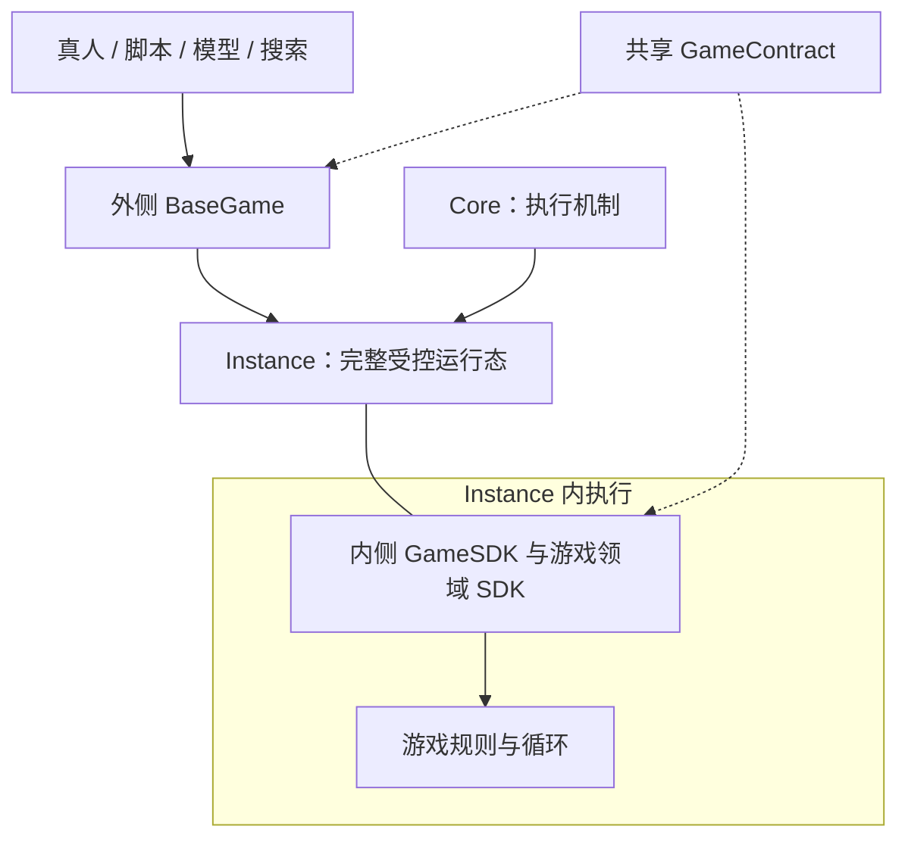

# Bear Forge 架构

Instance 是唯一完整运行态。BaseGame 与 GameSDK 是同一 GameContract 在执行边界两侧的使用方式，不是两套状态机。



| 部分 | 状态与职责 | 对外 |
| --- | --- | --- |
| Core | 通用程序准入、执行机制；无游戏语义 | start、可选 persistence/capture |
| Instance | 控制栈、局部值、闭包、对象图、SDK/服务状态、待决调用和记录 | bind/run/inspect/resume/fork?/transfer/close |
| 内侧 SDK | 在受控程序内创建，封装端口与领域组合；可变状态属于 Instance | GameSDK 的端口函数及领域扩展 |
| GameContract | 无可变状态；类型/schema 与纯投影、转换 | ports/finish/observe/inputs/queries |
| 外侧 BaseGame | 独占驱动一个 Instance；缓存仅为可重建数据 | bind/run/inspect/submit/observe/describe/validate/query/fork?/save?/close |
| 会话 | 身份权限、交付时刻、回执和重试 | 消费 BaseGame |
| 策略/搜索 | 策略记忆、候选、搜索树与评估 | 同一 BaseGame 接口 |
| 训练/分析 | 轨迹编码、奖励、实验条件与关系证据 | 消费观察、事件与结果 |

## 运行与数据流

1. 装载 ProgramModule 或其受控产物，Core.start(setup) 得到实际 Instance。
2. program.run 内创建 SDK；游戏局部状态、随机流、输入封存及事件发布位置全部留在 Instance。
3. SDK 通过 IO.call 发布声明端口。Instance 在外部输入等待处挂起。
4. BaseGameBinder.bind(instance,contract) 通过 Instance.transfer 接管驱动权，只投影当前边界。BaseGame.bind 注册游戏回调，包装为 Instance.bind 的通用端口回调。
5. BaseGame.run 委托 Instance.run；输入回调收到参与方可见观察及合法选项，回答经纯 respond 编码。手动 submit 使用同一回复接受路径；驱动租约禁止两者竞争。
6. 内侧程序验证返回并结算，继续自己的循环；外侧不调用另一份 apply。
7. event 端口经纯处理器投影后由外侧 onEvent 确认；它可以暂停，但不等待动画。decision 可回调回答或保持暂停；done 用 finish 提取结果及终局事件。

## 分支与恢复

Instance.fork → 新 Instance；BaseGame.fork → 给新 Instance 绑定同一 contract 的新 BaseGame。父子使用相同 API，互不推进；子实例/游戏不继承外部回调，运行前重新绑定。没有独立模拟入口、游戏快照或读取 target。

保存只有 InstanceSnapshot：BaseGame.save 委托底层保存，恢复走 persistence.restore → binder.bind。程序内 SDK/设备闭包一并恢复；外侧不补装随机状态或等待输入缓存。真实外部输入源属于调用方，确定性以相同显式回复为条件。

搜索直接 fork/inspect/submit/close；没有搜索运行层。普通游戏运行可以没有 fork/save。隐藏信息安全构造不等于复制真实 Instance，假设世界和访问权限仍由游戏及调用方规定。

## 文件树

```text
packages/contracts/src/
  core/        程序、Instance、端口、fork、保存与记录声明
  game/        外侧 BaseGame、输入、查询及可选上层结构类型
  authoring/   GameContract、GameModule、内侧 GameSDK 签名
  runtime/     装载与实际 Instance 绑定声明
games/doudizhu/src/
  schemas.ts   游戏领域和程序启动参数、端口 schema
  types.ts     公共协议特化
  program.ts   唯一规则主循环，创建内侧 SDK
  sdk.ts       决策端口封装、实例内随机流与洗牌发牌
  rules.ts     阶段、输入合法性与结算
  patterns.ts  牌型识别、比较与完整生成
  implementation.ts  program + 纯 contract 作者声明
  index.ts     游戏包入口
```

协议与证明见 [protocol.md](protocol.md) 及 evidence/C01/boundary-migration-review.md。当前有完整原生斗地主与协议检查；生产执行器、编译器、绑定器和保存分支尚未实现。
